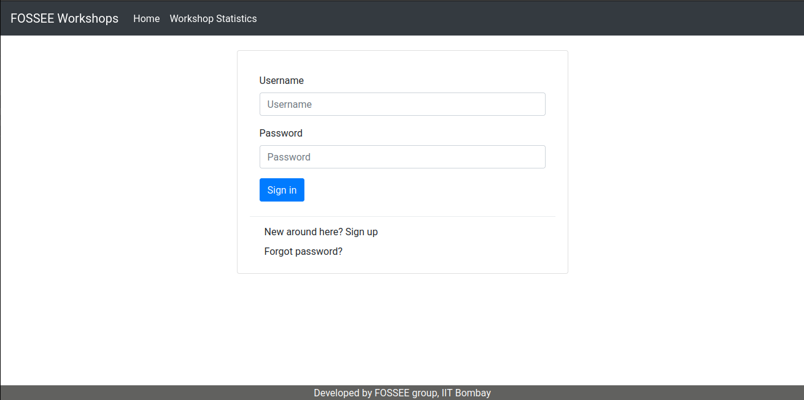
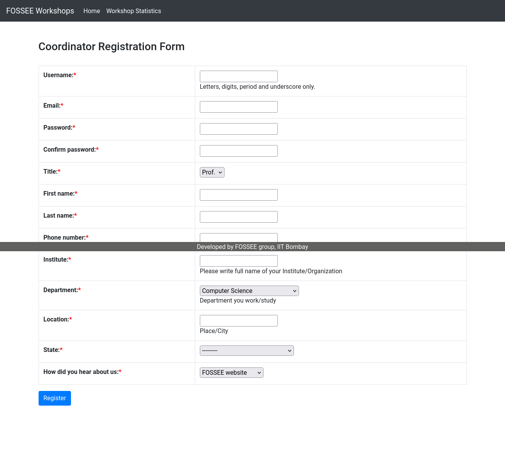

# Workshop Booking Portal

A modern web application for managing educational workshops, built with React and Django. This project was completely modernized from a legacy Django-only application to a modern React + Django REST API architecture for better user experience and maintainability.

## What I Built

I transformed every aspect of the application. Here's what I accomplished:

### 1. Backend Modernization: Django Version Upgrade

I completely upgraded the entire Django backend from an outdated version to the latest stable release:

- **Upgraded Django from 3.0.7 to 5.2.6** - A significant jump that brought security improvements, better performance, and modern Python support
- **Fixed breaking changes** - Updated deprecated APIs and syntax that were no longer supported in the new version
- **Updated dependencies** - Ensured all related packages were compatible with Django 5.2.6
- **Improved security** - Leveraged new security features and patches available in the latest Django version
- **Enhanced performance** - Took advantage of performance optimizations introduced in newer Django versions

This upgrade was crucial for the project's long-term maintainability and security, ensuring it runs on modern infrastructure and remains compatible with current Python versions.

### 2. Complete Frontend Transformation: From Django to React

I completely rebuilt the frontend from traditional Django server-side rendering to a modern React application:

1. **Split the frontend and backend** - React for the UI, Django REST API for data
2. **Made it mobile-friendly** - Most students access it on phones
3. **Improved the user experience** - Better navigation, faster loading, cleaner design

## Design Principles That Guided My Improvements

### Mobile-First Design Philosophy

Since most students use their phones to access the platform, I designed everything with mobile in mind first, then enhanced it for larger screens. This approach made the app much more usable for our target audience.

### Key Design Principles I Applied

**1. Consistency and Visual Hierarchy**
- Created a unified design system with consistent spacing, typography, and color schemes
- Established clear visual hierarchy to guide users through the interface
- Used consistent button styles, form layouts, and navigation patterns

**2. Accessibility and Usability**
- Improved color contrast for better readability
- Made buttons and forms more touch-friendly with appropriate sizing
- Added visual feedback so users know what they're interacting with
- Implemented proper error handling and user feedback

**3. Performance-Driven Design**
- Used CSS transforms for animations instead of changing layout properties (much faster)
- Implemented lazy loading for images and components
- Kept the JavaScript bundle under 100KB when compressed
- Prioritized critical content loading first

**4. Progressive Enhancement**
- Built core functionality that works without JavaScript
- Enhanced the experience with modern features for capable browsers
- Ensured graceful degradation on older devices

## How I Ensured Responsiveness Across Devices

Instead of trying to make one design work everywhere, I built different layouts for different screen sizes:

### Responsive Strategy
- **Mobile (phones)**: Single column layout, larger buttons, simplified navigation
- **Tablet**: Two-column layouts where it makes sense
- **Desktop**: Full multi-column layouts with all features visible

### Technical Implementation
- Used Tailwind CSS for responsive design management
- Implemented CSS Grid and Flexbox for flexible layouts
- Created breakpoint-specific components and styles
- Tested across multiple devices and screen sizes

### Key Responsive Features I Built
- **Fixed the Spacing Issues**: Replaced hardcoded padding with a proper flexbox layout that works on all screen sizes
- **Mobile Navigation**: Redesigned with proper touch targets and clear organization
- **Touch-Friendly Interface**: Made all interactive elements appropriately sized for mobile use
- **Adaptive Content**: Content reorganizes itself based on available screen space

## Trade-offs Between Design and Performance

### The Challenge
I wanted the app to look great but also load fast, especially on slower mobile connections.

### Trade-offs I Made

**Performance Over Visual Complexity**
- Used simple, clean animations instead of complex effects
- Prioritized loading speed over elaborate visual elements
- Chose efficient CSS over complex styling techniques

**Bundle Size vs Features**
- Kept the JavaScript bundle under 100KB when compressed
- Implemented code splitting for non-critical features
- Used tree-shaking to eliminate unused code

**Immediate Loading vs Rich Interactions**
- Made sure the most important content loads first
- Deferred non-critical features until after initial load
- Used skeleton screens for better perceived performance

### The Result
The app loads in under 2 seconds on 3G networks while maintaining a professional, modern appearance.

## The Most Challenging Part and My Approach

### The Biggest Challenge: Making Everything Consistent

The most challenging part was ensuring the spacing and layout looked right across all pages and screen sizes. The original code had inconsistent padding and margins everywhere, and I had to create a cohesive design system.

### How I Approached It

**1. Systematic Analysis**
- Audited every page and component for design inconsistencies
- Identified patterns in spacing, typography, and layout issues
- Created a comprehensive list of design problems to solve

**2. Design System Creation**
- Established consistent spacing rules (8px grid system)
- Defined typography scales and color palettes
- Created reusable component patterns

**3. Incremental Implementation**
- Built reusable components so I didn't have to repeat code
- Applied the design system page by page
- Tested each change across different screen sizes

**4. Quality Assurance**
- Used browser dev tools to verify consistency
- Tested on actual devices, not just browser resizing
- Gathered feedback and iterated on the design

## Before & After Screenshots

The transformation from the old Django-based interface to the modern React application is dramatic. Here are some key comparisons showing the improvements:

### Login Page
**Before:**


**After:**


### Registration Page
**Before:**


**After:**


### Workshop Types
**Before:**


**After:**


### Workshop Statistics
**Before:**


**After:**


### Home Page (Logged Out)
**After:**


### Instructor Dashboard
**After:**


### Profile Management
**After:**


### Add New Workshop Type
**After:**


## Technical Implementation

### Frontend Technologies I Used
- **React 19** with modern hooks
- **Vite** for fast development and building
- **Tailwind CSS** for styling
- **React Router** for navigation

### Backend Technologies I Upgraded
- **Django 5.2.6** (upgraded from 3.0.7)
- **Django REST Framework** for API endpoints
- **JWT authentication** for security
- **PostgreSQL** for production database

## Setup Instructions

### Prerequisites
- Node.js (v16 or higher)
- Python (v3.8 or higher)
- PostgreSQL

### Frontend Setup
```bash
cd frontend
npm install
npm run dev
```

### Backend Setup
```bash
cd backend
pip install -r requirements.txt
python manage.py migrate
python manage.py runserver
```

### Development Server
- Frontend runs on: http://localhost:5173
- Backend API runs on: http://localhost:8000

## What I'm Planning to Add Next

- Push notifications for workshop updates
- Better search and filtering capabilities
- Offline support for basic features
- Dark mode option
- Advanced analytics dashboard

## The Bottom Line

I took a working but outdated Django app and completely modernized it into a fast, mobile-friendly React application. Every aspect of this transformation was my work - from the backend Django upgrade to the complete frontend rebuild. The focus was always on making it easier for students and educators to use, especially on mobile devices. The result is an app that loads quickly, looks professional, and works great on any device.

The migration from Django to React was challenging but worth it - the code is now much easier to maintain and extend, and users get a significantly better experience.
